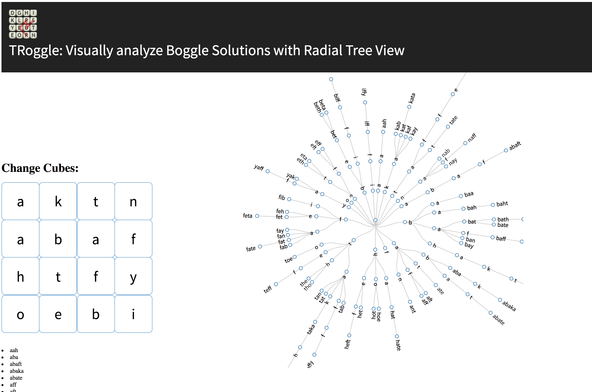

# Troggle App

The game [Boggle](https://www.wikihow.com/Play-Boggle) is game to make as many words out of random grids of letters (called a board).

The Troggle app is made with React, Node and D3 and deployed to Heroku to automatically solve Boggle boards and visualize the results in a radial tree view.

The live app can be [found here on Heroku.](https://troggle-app.herokuapp.com/) and when you access you should see a random board on the left, the tree view on the right and a plain list of words found in bullets below the grid, like this:



Enjoy!

# Build and run locally

In the repo root and react-ui/ these need to be run for the server and front-end, respectively:

```
npm i
npm start
```

and

```
npm i
npm run-script build
npm run-script start
```

# Citation

Had to copy source and modify the depth-first search (DFS) from the package [matrix-paths-zolmeister](https://www.npmjs.com/package/matrix-paths-zolmeister).
